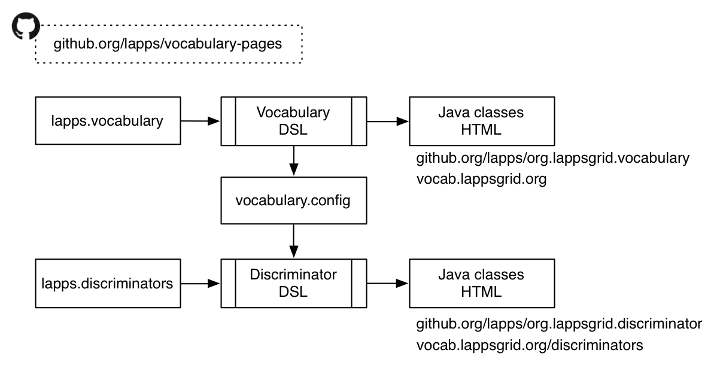

# {{ page.title }}

The main Git repository relevant to the vocabulary and discriminators is https://github.com/lapps/vocabulary-pages. In it, there are two files, `lapps.vocabulary` and `lapps.discriminators` that are maintained manually and that contain the specifications for the vocabulary and the list of discriminators. Both are configuration files written in domain-specific languages and are input to transformations from those configuration files to HTML pages and Java source code, as depicted below.

<div class="image">

<div class="caption"></div>
</div>

The Vocabulary DSL executable generates Java classes that need to be exported to the https://github.com/lapps/org.lappsgrid.vocabulary repository as well as a set of web pages that can then be put online at http://vocab.lappsgrid.org/. In addition it creates a file that contains elements of the vocabulary that are always considered discriminators, basically the names of annotation types.

The Discriminator DSL executable generates Java classes that need to be exported to the https://github.com/lapps/org.lappsgrid.discriminator repository and one HTML file that can be added to the vocabulary pages, more specifically, the content of http://vocab.lappsgrid.org/discriminators.html.

Details on how to run the code that creates the HTML pages and Java code are in the README file in https://github.com/lapps/vocabulary-pages.

As hinted at above, the Vocabulary DSL and Discriminator DSL are Groovy Domain-Specific Languages (DSLs) for the vocabulary and the discriminators. The DSLs are defined in two repositories:

  1. https://github.com/lappsgrid-incubator/vocabulary-dsl
  2. https://github.com/lappsgrid-incubator/discriminator-dsl

Both these repositories allow you to create a shell script and a jar that can be used by the code in https://github.com/lapps/vocabulary-pages to create the vocabulary pages and Java source code.


## Vocabulary

Vocabulary pages are defined by top-level elements of the `lapps-vocabulary` file. Here is the element that defines the http://vocab.lappsgrid.org/NamedEntity page:

```
NamedEntity {
    parent "Region"
    definition "A phrase that clearly identifies an individual from others that have similar attributes, such as the name of a person, organization, location, artifact, etc. as well as temporal expressions."
    sameAs "$iso/DC-2275"
    discriminator 'ne'
    metadata {
    	namedEntityCategorySet {
    		type "String or URI"
    		description "The set of values that can be used for the category property."
    	}
    }
    properties {
    	category {
    		type "String or URI"
    		required true
    		description "The type of named entity. Typically one of DATE, PERSON, ORGANIZATION, or LOCATION."
    	}
    	type {
    		type "String or URI"
    		description "A type attribute for the entity. For example the type of location or organization."
    	}
        gender {
            type "String or URI"
            description "A value such as male, female, unknown. Ideally a URI referencing a pre-defined descriptor."
        }
    }
}
```

The properties directly under `NamedEntity` (`parent`, `definition`, etcetera) are a fixed group, but you are allowed to add any property under `metadata` and `properties`, as long as the values of those properties themselves have properties from the set {`type`, `required`, `description`}, the default for `required` is `false`. The `discriminator` property is optional and is used to overrule the default used when discriminators are generated from the vocabulary entry, the default is to use the same name but in lower case. There is one more property that is illustrated below.

```
Date {
    parent "NamedEntity"
    definition "A reference to a date or period."
    similarTo "http://schema.org/Date"
    sameAs "$iso/DC-6123"
    deprecated NE_DEPRECATED
    properties {
        dateType {
            type "String or URI"
            description "Sub-type information such as date, datetime, time, etc. Ideally a URI referencing a pre-defined descriptor."
        }
    }
}
```

The `deprecated` property indicates that the `Date` annotation type will be removed in the future version of the vocabulary. The `NE_DEPRECATED` is a variable defined earlier in the vocabulary file which sets the message to be displayed:

```
NE_DEPRECATED = '''Use <link>NamedEntity</link> with appropriate @category and @type attributes instead. This annotation type will be removed in a future version of the vocabulary.'''
```


## Discriminators

Some of the discriminators are generated automatically from the vocabulary by `make vocabulary` when running this command from the vocabulary-pages repository. For each annotation type a discriminator is generated using the annotation type name in lower case (unless the `discriminator` property is used). In addition, some of the properties will be added as discriminators. What properties those are is currently hard-wired in the code in [VocabDsl.groovy](https://github.com/lappsgrid-incubator/vocabulary-dsl/blob/master/src/main/groovy/org/anc/lapps/vocab/dsl/VocabDsl.groovy), at the moment only `token#pos` and `token#lemma` are added.

Many other non-vocabulary discriminators are defined in `lapps.discriminators`. Here is an example:

```groovy
lif {
  uri media('jsonld#lif')
  description "LAPPS Interchange format. (LIF)"
}
```

Note that `media` is a closure that is defined at the top of the file, it expands to the full URI for media types (actually, using another embedded closure). The link target does actually exist and has content and the value of `description` is in that page (http://vocab.lappsgrid.org/ns/media/jsonld#lif).


<!--

## Updating the vocabulary

Repositories involved:

1. https://github.com/lapps/vocabulary-pages
1. https://github.com/lappsgrid-incubator/vocabulary-dsl
1. https://github.com/lappsgrid-incubator/discriminator-dsl
1. https://github.com/lappsgrid-incubator/org.lappsgrid.github.commit

The first contains `lapps.vocabulary`, which contains the actual vocabulary in some format. There is a Makefile that has four goals that are of interest:

You can run them all by doing

```
$ make all
```

This relies on a jar `vocab-1.2.2.jar`, which happens to have (April 13th) a hard-coded path in the `vocab` bash script.

-->
