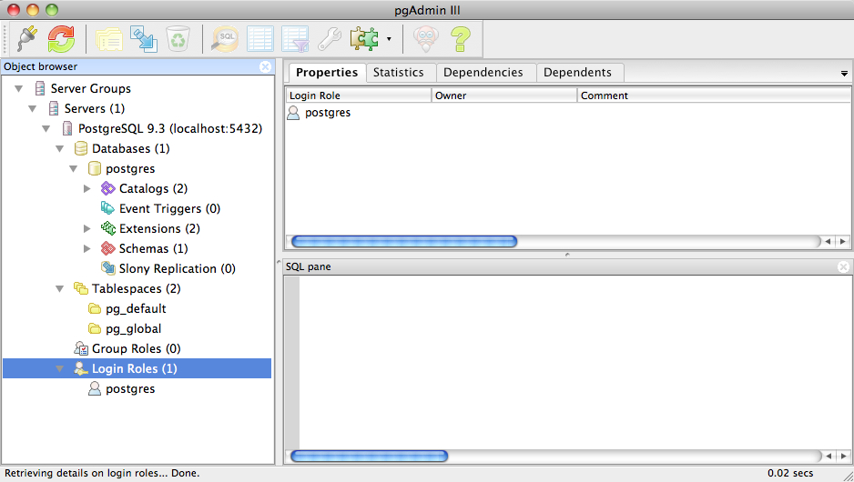
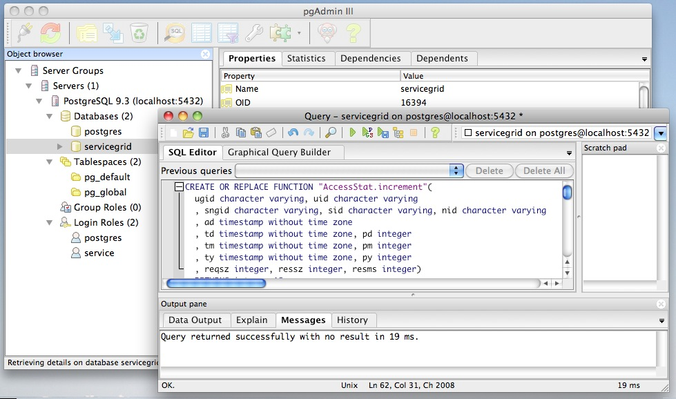

# Installing a Service Grid on Max OSX

Version 3, Marc Verhagen, April 2014.

[ [sources](#sources) | [postgres](#postgres) | [service grid](#service) ]

This document describes how to install the service grid software from scratch on a Mac running OSX 10.6.8.
<a name='sources'></a>

## Downloading Sources

In the directory where this html file lives (and, more importantly, the installation script), create a new directory named `sources`, then subdirectories `langrid`, `postgres` and `tomcat`. To install a service grid, we need Tomcat, PostgreSQL and the Service Grid code.

<table>
<tr valign='top'>
<td>Tomcat</td><td>Get Apache Tomcat from <a href='http://tomcat.apache.org/'>http://tomcat.apache.org/</a> (I got apache-tomcat-7.0.53.tar.gz) and put it in <code>sources/tomcat</code>. You also need the Apache Commons DBCP and the Apache Commons Pool to make tomcat ready for the service grid. Get commons-dbcp-1.4-bin.tar.gz from <a href='http://commons.apache.org/dbcp/download_dbcp.cgi'>http://commons.apache.org/dbcp/download_dbcp.cgi</a> and commons-pool-1.6-bin.tar.gz from <a href='http://commons.apache.org/pool/download_pool.cgi'>http://commons.apache.org/pool/download_pool.cgi</a>. Add both to <code>sources/tomcat</code>. All archives need to be unpacked.</td></tr>
<tr valign='top'>
<td>PostgreSQL</td><td>Get the installer from <a href='http://www.postgresql.org/download/'>http://www.postgresql.org/download/</a> and the database driver from <a href='http://jdbc.postgresql.org/download.html'>http://jdbc.postgresql.org/download.html</a>. At the time of this writing, the most recent version was postgresql-9.3.4-3-osx.zip. For the driver, I used the link "JDBC4 Postgresql Driver, Version 9.3-1101". Add the driver to <code>sources/postgres</code>.</td></tr>
<tr valign='top'>
<td>Service Grid</td><td>Code is available at <a href='http://sourceforge.net/projects/servicegrid/files/'>http://sourceforge.net/projects/servicegrid/files/</a>. Click "Service Grid Server Software" and get <ul><li>langrid-corenode-p2p-2.0.0-20120718.zip</li>
<li> jp.go.nict.langrid.webapps.langrid-core-20130904.war</li>
</ul>The zip file contains a WAR file named langrid-2.0.0.war, but it is defective, instead we need to use the loose WAR file. Put the unzipped zip file and the war file in <code>sources/langrid</code>.</td></tr>
</table>
<a name='postgres'></a>

## Setting up a PostgreSQL Database

Installation is a fairly simple process, even though it is not immediately clear what happens behind the screens, I do not quite remember how I figured out what to do and the postgres documentation is at first glance not very helpful. There are two steps.

1. Create /etc/sysctl.conf with the following content 
```
kern.sysv.shmmax=1610612736
kern.sysv.shmall=393216
kern.sysv.shmmin=1
kern.sysv.shmmni=32
kern.sysv.shmseg=8
kern.maxprocperuid=512
kern.maxproc=2048
```

The main goal here is to increase shared memory. After this, you need to reboot the system so the settings above take effect.

1. Double click the installer and use all defaults, the only thing that really needs to be entered is the password of the postgres user. PostgreSQL will be listening on the default port 5432. PostgreSQL libraries are installed in `/Library/PostgreSQL/9.3` (which also has the psql command line tool in the bin directory).

The installation includes pgAdmin III and the application stack builder, which can be used to add some extensions. With pgAdmin, creating a database for the service manager is a five-step procedure:

1. Open pgAdmin3 in `/Applications/PostgreSQL 9.3` and select the PostgreSQL 9.3 Server in the Object Browser, then right-click it and select "Connect" in order to see and connect to your databases. 
1. Select "Login Roles" and right-click it. Select "New Loging Role...". Add a role (eg 'service'), give it a password under the Definition tab (eg 'servicepw'). Right-click the login role and select "properties" to change the password. 



1. Now select "Databases" and right-click it. Select "New Database...". Give it a name (eg 'servicegrid') and an owner ('service').
1. Select the newly created database and click the SQL button in the top menu. Paste in the contents of `source/langrid/langrid-corenode-p2p-2.0.0-20120718/postgresql/create_storedproc.sql` (or its [local
    copy](examples/create_storedproc.sql) in this manual). You can use the "Open File" button for this (second on the left on the menu bar). Then click "Execute query" (the green right arrow on the menu bar). You should get a message indicating success as below. 



1. Select the function that was just created ("servicegrid > Schemas > public > Functions") and double click the owner in the properties tab (a dialog appears, click OK, then a new dialog appears which has the habit of disappearing behind the main window). Now change the owner from postgres to service.

A few remarks on the above:

1. All this can also be done with the `installdb.sh` script in `sources/langrid/langrid-corenode-p2p-2.0.0-20120718/postgresql`. This script creates the login role and the database, executes "createlang plpgsql $1" and alters a function by changing the owner. Creating the plpqsql language is not needed for PostgreSQL 9, the others were all done in the steps above.
1. The actual database tables are installed later, when the service manager code in the Tomcat instance is first executed.

You can now close pgAdmin and install the service manager.
<a name='service'></a>

## Installing the Service Manager

We will now create a new Tomcat server that runs the Service Manager code in `tomcat-sm`. We do this from scratch, assuming all sources are in the `sources` directory as specified in the section on downloading sources. The new server will use the servicegrid database owned by the service login role. There are two steps:

1. 
Create a file with all settings. There are a couple of pre-baked settings available in `settings-service-manager-lh.txt` and `settings-service-manager-ip.txt`, where the first one creates a service manager that can be accessed through the URL http://localhost:8080 and the second one an identical service manager except that it can be accessed by an IP address, both access the same database. An annotated example of a settings file is in [examples/settings-service-manager.txt](examples/settings-service-manager.txt)

1. 
Run `install.py`, which takes two required arguments: the settings file and the target directory. This script makes some assumptions about the structure of the sources directory so it is important that the downloading instructions were followed to the letter.

```
% python install.py settings-service-manager-lh.txt tomcat-sm
```

This adds a Tomcat user named 'tomcat' with password 'tomcatpw' to the tomcat users file. This user can manage the applications. You can define another username and password by invoking `install.py` with two extra arguments:

```
% python install.py settings-service-manager-lh.txt tomcat-sm USER
PASSWORD
```


The install script also starts the Tomcat instance. You can manually start up and shut down the Tomcat instance like this:

```
% tomcat-sm/bin/startup.sh 
% tomcat-sm/bin/shutdown.sh 
```

With Tomcat running, and assuming you ran the install script exactly as printed above, you can access the Tomcat server on port 8080 at [http://localhost:8080](http://localhost:8080). The Service Manager is available at [http://localhost:8080/service_manager](http://localhost:8080/service_manager). The first time you open Tomcat or the Service Manager it may take a while because Tomcat is creating the Service Manager application in `webapps/service_manager`, using the Service Manager's .war file. If you get an error message "Requested resource not available", then you probably have a problem with PostgreSQL, you can confirm this in the logs directory of the server. The problem usually is that the database name or password does not match or that you forgot to start PostgreSQL.

## Installing the Service Manager — Details

The installations is done and it is safe to stop reading now. This section gives the details on what is ging on behind the screens when installing the service manager. These are older notes and at points refer to Active BPEL, which used to be installed in tandem with the service manager.

1. 
First you install Tomcat and add a few libraries that the service manager needs. Installation is a matter of unpacking the tar.gz file and putting it somewhere. See RUNNING.txt in the Tomcat distribution for more details.

```
% cp -R sources/tomcat/apache-tomcat-6.0.35 tomcat-sm
% cp sources/commons-dbcp-1.4.jar
tomcat-sm/lib/commons-dbcp-1.4.jar
% cp sources/commons-pool-1.6.jar
tomcat-sm/lib/commons-pool-1.6.jar
% cp sources/postgresql-9.1-902.jdbc4.jar
tomcat-sm/lib/postgresql-9.1-902.jdbc4.jar
```

I am assuming here that all the downloaded sources live in "sources" and that the tomcat archive was expanded. Note also that the script assumes some structure inside the sources directory.

One thing this script does in this step is calling a Python script that adds a tomcat user to `tomcat-base/conf/tomcat-users.xml` and allows this user to run the Tomcat Manager. By default, this user is "tomcat" and has the password "tomcat". You may want to change the password in `scripts/adjust_tomcat_users1.py`.
Note that the default install is for port 8080 and that you have to do some stuff to make it otherwise (which is what you do at some point when installing bpel). To install tomcat on another port, you will have to look at conf/server.xml in the tomcat home directory, where you have to change the Connector for the HTTP protocol. 
To start and shut down tomcat do this:

```
% tomcat-sm/bin/startup.sh 
% tomcat-sm/bin/shutdown.sh 
```

After startup, you can access the tomcat server at [http://localhost:8080](http://localhost:8080) (or use an IP address if you have one). When doing a process listing with Tomcat running, you should see a tomcat process which will look like this:

```
/System/Library/Frameworks/JavaVM.framework/Versions/CurrentJDK/Home/bin/java
  
-Djava.util.logging.config.file=/Users/marc/Sites/tomcat-servicegrid/conf/logging.properties
  
-Djava.util.logging.manager=org.apache.juli.ClassLoaderLogManager
  
-Djava.endorsed.dirs=/Users/marc/Sites/tomcat-servicegrid/endorsed
   -classpath
/Users/marc/Sites/tomcat-servicegrid/bin/bootstrap.jar
   -Dcatalina.base=/Users/marc/Sites/tomcat-sm
   -Dcatalina.home=/Users/marc/Sites/tomcat-sm
   -Djava.io.tmpdir=/Users/marc/Sites/tomcat-sm/temp
   org.apache.catalina.startup.Bootstrap start
```

1. 
Copy the service_manager.xml configuration file:

```
% mkdir tomcat-sm/conf/Catalina
% mkdir tomcat-sm/conf/Catalina/localhost
% setenv LANGRID_SOURCE
sources/langrid/langrid-corenode-p2p-2.0.0-20120718
% cp
  
$LANGRID_SOURCE/tomcat-langrid/conf/Catalina/localhost/langrid-2.0.xml
   tomcat-sm/Catalina/localhost/service_manager.xml
```

The setenv command is used for display purposes (without it, the path to langrid-2.0.xml does not fit on one line) and the last command is not quite correct since line breaks were added for display reasons. The first two steps are not needed if you had at some point started the tomcat server. If you had started it, it is best to shut it down before you do all this.

1. Edit `tomcat-sm/Catalina/localhost/service_manager.xml` to insert the relevant settings. See [examples/service_manager.xml](examples/service_manager.xml) for an example. While this can be done manually, this is a tad tedious and error prone since you will have to redo everything every time you do this and everything means editing about 20 spots in service_manager.xml. Instead, edit a settings file in this directory (for example `settings-service-manager.txt`) and run a python script to insert the settings into the xml file. 
```
% mv tomcat-sm/conf/Catalina/localhost/service_manager.xml
     tomcat-sm/conf/Catalina/localhost/service_manager.xml.org
% python scripts/create_service_manager_xml.py 
     settings-service-manager.txt 
     tomcat-sm/conf/Catalina/localhost/service_manager.xml.org
     tomcat-sm/conf/Catalina/localhost/service_manager.xml
```
There are a couple of pre-baked settings files available (settings-service-manager-lh.txt and settings-service-manager-ip.txt), where the first one creates a service manager that can be accessed through the URL http://localhost:8080 and the second one an identical service manager except that it can be accessed by an IP address, both access the same database. An annotated example of a settings file is in [examples/settings-service-manager.txt](examples/settings-service-manager.txt)
1. Copy the service manager war file to the Tomcat webapps directry: 
```
% cp
sources/langrid/jp.go.nict.langrid.webapps.langrid-core-20120718-2.war
     tomcat-sm/webapps/service_manager.war
```
(By the way, if new code is released and you want to update your Service Manager, all you need to do is to stop Tomcat, remove `tomcat-sm/webapps/service_manager` and `tomcat-sm/webapps/service_manager.war`, redo the step above, and restart Tomcat. This preserves all settings in the configuration file.)

In step 3 above, I refered to the XML settings file named `service_manager.xml` and an associated text file `settings-service-manager.py`. By editing the latter and using the Python script to insert the settings you avoid some annoying bookkeeping on the XML file. The parameters that need to be set occur in both files. Basically, the text file defines substitutions for the xml file. Below is a line from each file to illustrate this.

<table>
<tr valign='top'>
<td>service_manager.xml</td><td><Parameter name="langrid.node.url" value="${NODE_URL}"/></td></tr>
<tr valign='top'>
<td>settings-service-manager.txt</td><td>${NODE_URL}    http://localhost:8080/service_manager</td></tr>
</table>
The parameters that are relevant for hooking up the Service Manager with Active BPEL, with variable names and actual values used, are printed below: 
<table>
<tr valign='top'>
<td>langrid.node.name</td><td>${NODE_URL}</td><td>http://localhost:8080/service_manager</td></tr>
<tr valign='top'>
<td>appAuth.simpleApp.authKey</td><td>${AE_TO_CORE_APPAUTHKEY}</td><td>ccbbaa</td></tr>
<tr valign='top'>
<td>langrid.activeBpelServicesUrl</td><td>${CORE_TO_AE_BASEURL}</td><td>http://localhost:8081/active-bpel/services</td></tr>
<tr valign='top'>
<td>langrid.activeBpelAppAuthKey</td><td>${CORE_TO_AE_APPAUTHKEY}</td><td>aabbcc</td></tr>
</table>

The first two parameters encode how the Service Manager is going to be known to the Active BPEL instances and the second two are how the Active BPEL instance will be known to the Service Manager. Note that in an earlier version of the software (20101210), ${CORE_TO_AE_BASEURL} and ${CORE_TO_AE_APPAUTHKEY} were named ${INVOKER_TO_AE_BASEURL} and ${INVOKER_TO_AE_APPAUTHKEY} respectively. Also note that in the service_manager.xml file that is created in step 2, there are two lines with the parameter langrid.activeBpelServicesUrl. The second one, with value "http://${AE_TOMCAT_ADDRESS}/active-bpel/services", was removed in step 3 by the Python script.
