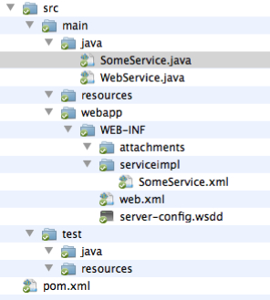
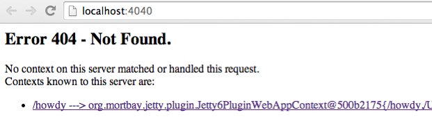
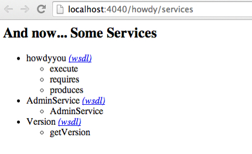

# Wrapping LAPPS Services

This document describes how to wrap very simple services as LAPPS services. These services are LAPPS-compliant in the sense that they have the rewuired methods, they do not however generate data in the LAPPS Interchange Format.

## The code to be wrapped

We are wrapping Hello.java:

```
public class Hello {

    public static final void main (String [] args ) {
        System.out.println("Hello " + args[0]);
    }
}
```

## Project template

You start with the template in template.zip, which has the following directory structure:




Once you have unpacked the template, you should rename the directory (for this example, let's say we use "howdy") and add you code file Hello.java to src/main/java.

## Editing files

The first file to edit is the pom.xml file. The Project Object Model file contains all necessary information about a project, as well as configurations of plugins to be used during the build process. It is, effectively, the declarative manifestation of the "who", "what", and "where". ( [http://maven.apache.org/pom.html](http://maven.apache.org/pom.html)).

The top of this file looks as follows:

```
<project ...>
  <modelVersion>4.0.0</modelVersion>
  <groupId>org.lappsgrid</groupId>
  <artifactId>ENTER_IDENTIFIER</artifactId>
  <version>ENTER_VERSION</version>
  <packaging>war</packaging>
  <name>ENTER_NAME</name>
  <description>
      ENTER_DESCRIPTION
  </description>
  ...
```

You need to fill in the artifactId, which has to be a unique name if you want to publish it, that is, unique to the group, which in this case is org.lappsgrod. Filling in some reasonable values:

```
  <modelVersion>4.0.0</modelVersion>
  <groupId>org.lappsgrid</groupId>
  <artifactId>howdy</artifactId>
  <version>0.1</version>
  <packaging>war</packaging>
  <name>Howdy You</name>
  <description>
        Greets you with the provided name
  </description>
```

The meat of the work is to edit your Hello.java file in order to make it a LAPPS-compliant web service. There is a skeleton WebService in src/main/java/SomeService.java:

```
import java.io.*;

import org.lappsgrid.api.Data;

public class SomeService implements WebService{

    public long[] requires() {
        return new long []{3}; }

    public long[] produces() {
        return new long []{3}; }

    public Data execute(Data input) {
        Data out = new Data();
        out.setDiscriminator(3);
        out.setPayload(input.getPayload());
        return out;
    }
}
```

This service takes a text (indicated by the identifier 3) and produces a text. When you execute the service, the payload (the string given as an argument) is copied back. You now edit Hello.java, in effect making it a hybrid of its former self and the SomeService.java example:

```
import java.io.*;
import org.lappsgrid.api.Data;

public class Hello implements WebService {

    public static final void main (String [] args ) {
        System.out.println("Hello " + args[0]);
    }

    public long[] requires() {
        return new long []{3};
    }

    public long[] produces() {
        return new long []{3};
    }

    public Data execute(Data input) {
        Data out = new Data();
        out.setDiscriminator(3);
        out.setPayload("Hello " + input.getPayload());
        return out;
    }
}
```

Some notes:

1. The Hello class is now an implementation of the WebService class
1. The org.lappsgrid.api.Data class needs to be imported. This class simply supports objects that have a payload and a discriminator. In our case, the discriminators is "text".
1. The execute() method wraps what was formerly done in the main() method. The main task here is to hook into the existing code and pull what is needed into the Data object.

One more file needs to be edited: src/main/webapp/WEB-INF/serviceimpl/SomeService.xml. This file should actually first be renamed into something sensible, in this case hello.xml or howdy.xml would be good names, but for explanatory purpuses we'll use howdyyou.xml. This name is later used in the Jetty server. All that needs to be changed is to replace the class name with the current class name:

```
<?xml version="1.0" encoding="UTF-8"?>
<!DOCTYPE beans PUBLIC "-//SPRING//DTD BEAN//EN" 
      "http://www.springframework.org/dtd/spring-beans.dtd">
<beans>
  <bean id="target" 
       
class="jp.go.nict.langrid.servicecontainer.handler.TargetServiceFactory"
>
    <property name="service">
      <!-- edit this class name -->
      <bean class="Hello" />
    </property>
  </bean>
</beans>
```

Optionally, you can edit src/main/webapp/WEB-INF/web.xml. Near the top, there is a tag named display-name, edit this if you care about how your service is displayed in TomCat.

## Compiling and creating the service.
You now use Maven to compile, create a package and test the service on jetty: 
```
$ mvn compile
$ mvn package
$ mvn jetty:run
```

When this is running, and especially the first time, Maven may be frantically downloading jar files. This is normal. Warnings are also normal. There should be no errors though. At the end of all this, you will see the line:

```
[INFO] Starting scanner at interval of 10 seconds.
```

This indicates that the Jetty server is now running and you can access it on your brower using [http://localhost:4040](http://localhost:4040). When you click this link, you will see something like:




Ignore the error and just click the link. This will lead you to a new page [http://localhost:4040/howdy](http://localhost:4040/howdy/). Now add "service" to the url, that is, go to [http://localhost:4040/howdy/services](http://localhost:4040/howdy/services).




A few notes on the names. In the URLs, we consistently saw "howdy" as an identifier, this is driven by the artifactId enterd in the POM file. In the images right above, we see "howdyyou", which is taken from the name of the XML file in src/main/webapp/WEB_INF/serviceimpl. Notice how the service exposes execute, requires and produces methods.
