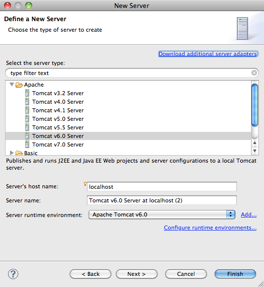
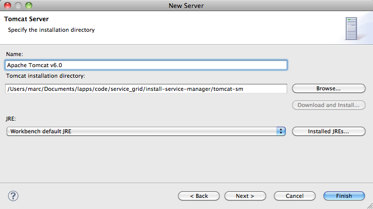
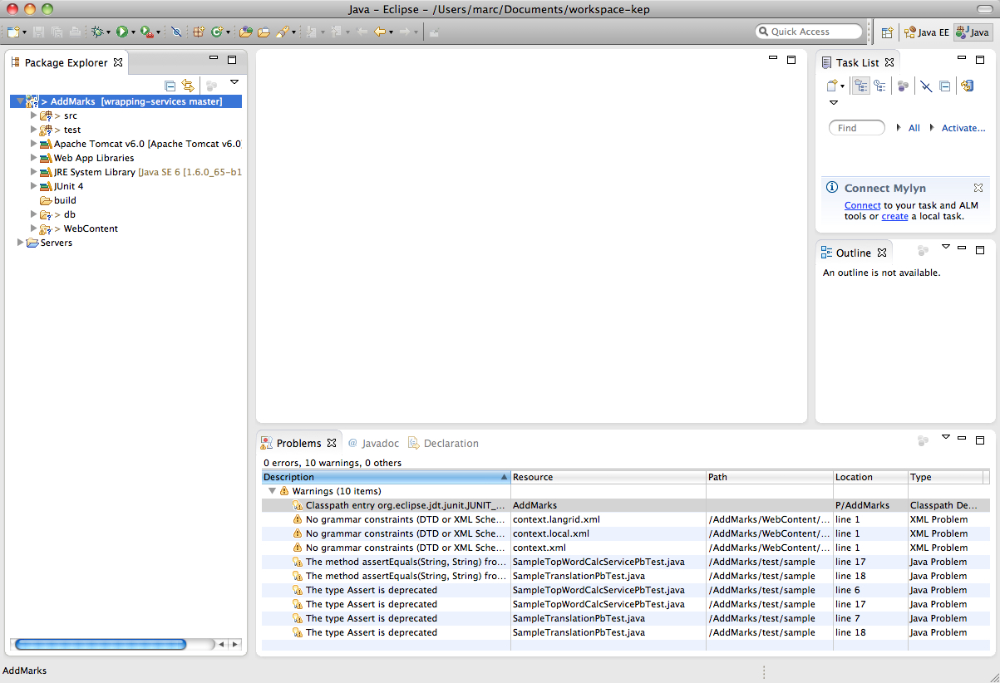
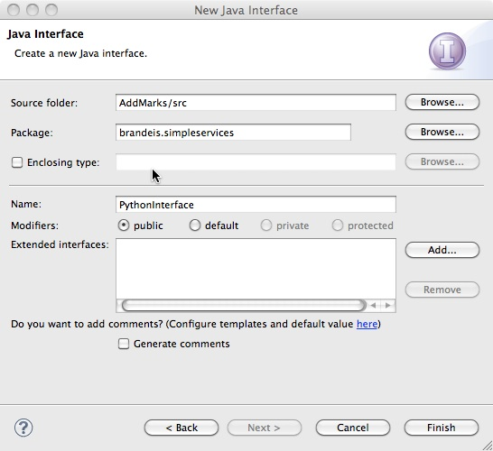
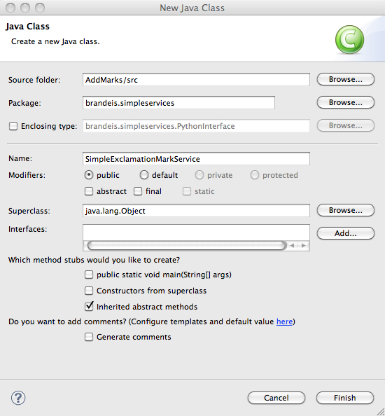
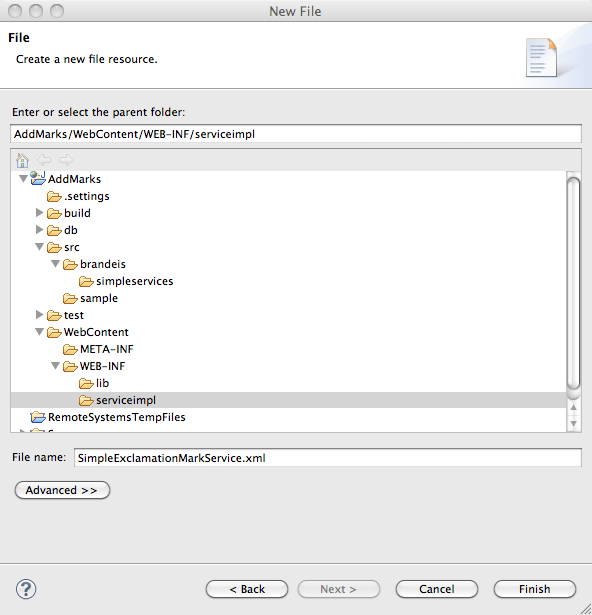
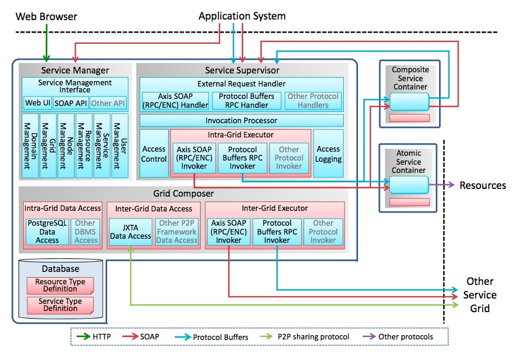

[ [wrapping](#wrapping) | [creating the service](#creating-service) | [testing](#testing-service) | [deployment](#deployment) | [service grid](#service-grid) | [questions](#questions) ]

# Creating Services for the Service Grid

Marc Verhagen, Version 4, April 2014

This document contains cleaned up notes on how to wrap services for the service grid. It was written from the perspective of a Java and web services nitwit who wants to wrap Python scripts so some things obvious to a Java programmer may be spelled out in detail. Also, this document lays out how to install a service without using Maven.

These notes assume that you have Tomcat and the service manager installed and that you know how to connect to the Tomcat Manager and the Service Manager as an administrator. In addition, you need to get the following stuff:

1. The blank language application package from [http://servicegrid.sourceforge.net/](http://servicegrid.sourceforge.net/). Click "Download Service Grid files", then click "Language Grid". Do NOT get the most recent package from 20130308, but get the version from 20130221 (langrid-webapps-blank-20130221.zip). A local copy is in the [sources](sources/) directory. This archive contains the skeleton code for creating language grid services. Put it somewhere, but there is no need to unarchive it immediatley.
1. The SoapUI application for testing web services from [http://sourceforge.net/projects/soapui/](http://sourceforge.net/projects/soapui/). Click the files tab, then "soapui", then "4.5.1", then get what's relevant for your machine (I took soapui-4.5.1-mac-bin.zip). Unarchive it and put it somewhere convenient. You run it from a command line by typing "sh bin/soapui.sh &" from within the soapui-4.5.1 directory.
1. Get Ecplise from <a name='null'></a>
 and install it somewhere.

Building a service can be done without SoapUI or Eclipse, but in the instructions below the former is used for testing and the latter for testing and code creation.
<a name='wrapping'></a>

## Wrapping the Python Scripts in Java

As an example, I used two simple Python scripts that both append a character to the end of the input. They have in common that they take one argument and print the result to standard output. They both import from a local module, this was to test whether those kinds of imports do not break the system. I should probably also try with more complex imports and changes of the Python path, which is what we do for the Tarsqi toolkit. The three Python scripts used are:

1. [add_exclamation_mark.py](code/add_exclamation_mark.py)
1. [add_question_mark.py](code/add_question_mark.py)
1. [marks.py](code/marks.py)

These scripts can live anywhere on the server, but note that the wrapping process includes defining where they are, so you have to take some care when you develop the services on one machine and then deploy them on another machine. More detials on this later.

Now we wrap these in Java with the following two scripts:

1. [AddExclamationMark.java](code/AddExclamationMark.java)
1. [AddQuestionMark.java](code/AddQuestionMark.java)

You will have to edit these scripts and change the value of the script variable in the main method. I have no claims on this being good Java code, but it worked:

```
% javac AddExclamationMark.java
% java -classpath . AddExclamationMark ole
ole!
```

Amended versions of these scripts will be used when creating the service.
<a name='preparing-eclipse'></a>

## Preparing Eclipse

Open Eclipse. The first thing you want to do on a virgin Eclipse is to create a server. Select "File > New > Other > Servers > Server", then the Apache Tomcat server that you want. The default name (Tomcat v6.0 Server at localhost) is fine.




As part of this process you need to enter the location of your tomcat server. This can be any Tomcat server, it does not need to be a Tomcat server with the Service manager installed.




This should be easy but it can be a pain in the extreme lower back. I did this with a new install of Eclipse Kepler SR2 and it worked fine. it also worked fine when I first did this on Eclipse Juno SR2, but later, when I had removed the Tomcat 6 servers and tried to install a new one, Eclipse would not let me (the "Server name" input box was empty and the "Next" button was greyed out; this was only an issue with the Tomcat 6 server, others could still be created).

In even older versions you may need to edit, add and/or configure the runtime environment (part of this is specifiying where the tomcat server is located) yet I have no idea how I did this. In a previous version I also ran into some other rather puzzling behaviour. At first, the older version would not let me create a tomcat 6 server because there was already one defined so I had to delete it. Later it kept insisting on creating a new Servers directory to put in new servers. It did not seem to matter though.
<a name='creating-service'></a>

## Creating the Service

We now create a project. For this we need the `sources/langrid-webapps-blank-20130221.zip` archive. This archive has the skeleton code for creating services. Unzip it and rename the result into something that makes sense, for these notes, we rename `langrid-webapps-blank-20130221` into `langrid-webapps-marks-v1`. This directory will turn into an Eclipse Java project and when we are done it will have the code for a related set of services, all wrapping Python scripts that add characters to the end of a string.

Open the project in Eclipse by selecting "File > New > Java Project" (if there is no"'Java Project" under "File > New", then do "File > New > Other" and navigate till you find "Java Project", using the wizards input field and typing "Java Project" will help).


You will be asked for a project name (AddMarks) and a location. If we had renamed `langrid-webapps-blank-20130221` into `AddMarks` and if we had put it in the default Ecplise workspace, we could have used the default location, but since we used `langrid-webapps-marks-v1` we have to define the location by hand. You may get a dialog about what kind of perspective to use, follow the suggestion and you'll get something like the window below.




In older Eclipse versions, the Eclipse package explorer for AddMarks may not have a JUnit library. You can add it by selecting AddMarks and "File > Properties". Then select "Java Build Path > Libraries > Add Library > JUnit > Junit 4" (in some version of Eclipse you may not have to press a "Libraries" tab before you click "Add Library").

With the project and server in place, we can create the java classes needed for the service. We create an Interface and two classes that implement the interface, one each for the two python script that we are wrapping:

1. PythonInterface.java
1. SimpleExclamationMarkService.java
1. SimpleQuestionMarkService.java

The create the interface use "File > New > Interface" and fill in the package name and the interface name. In the example below, I have used brandeis.simpleservices for the package name and PythonInterface for the interface name, but you can use anything you want.




Once you have clicked "Finish", Eclipse creates an interface named PythonInterface.java and gives it some skeleton code:


The skeleton code should be replaced with the code printed below, which defines the interface for the services. It defines the method used by the service classes and the parameters for that method. In this case, we only have one parameter, the input string to the python script. It is not clear to me whether all the exceptions are needed, the exceptions were lifted from some Language Grid interface. I am also not clear on how exactly the names space plays into this, I figure we could always uses something like servicegrid:servicetype:<site>:<interface_name>, but I am not sure.

```
package brandeis.simpleservices;

import jp.go.nict.langrid.commons.rpc.intf.Parameter;
import jp.go.nict.langrid.commons.rpc.intf.Service;
import jp.go.nict.langrid.service_1_2.AccessLimitExceededException;
import jp.go.nict.langrid.service_1_2.InvalidParameterException;
import jp.go.nict.langrid.service_1_2.NoAccessPermissionException;
import jp.go.nict.langrid.service_1_2.NoValidEndpointsException;
import jp.go.nict.langrid.service_1_2.ProcessFailedException;
import jp.go.nict.langrid.service_1_2.ServerBusyException;
import jp.go.nict.langrid.service_1_2.ServiceNotActiveException;
import jp.go.nict.langrid.service_1_2.ServiceNotFoundException;
import
jp.go.nict.langrid.service_1_2.UnsupportedLanguagePairException;

@Service(namespace="servicegrid:servicetype:brandeis:PythonInterface")
public interface PythonInterface {

      public String addMark(
              @Parameter(name="inputString") String inputString)
       throws AccessLimitExceededException,
InvalidParameterException
        , NoAccessPermissionException
        , ProcessFailedException, NoValidEndpointsException
        , ServerBusyException, ServiceNotActiveException
        , ServiceNotFoundException,
UnsupportedLanguagePairException;
}
```

As an aside, the example that came with the sample code in our project is much simpler. It is not wrong and will work, but because it does not have any of the pre-defined exceptions, it will be less effective in the service manager environment.

With the interface in place, we can now create the exclamation mark and question mark services, here shown just for one of them. In Eclipse, the way to create a regular class is similar to creating an interface and involves the "File > New" menu. For the exclamation service file you can use the settings below. I think the package name has to be the same as for the interface, but I am not sure.




Again, when you press "Finish" Eclipse will create the class with some skeleton code:


The SimpleExclamationMarkService.java file implements the Python interface above. The skeleton code needs to be replaced with the code below. That code is based on the Java wrapper named AddExclamationMark.java, but there are changes because the code now needs to run in the context of a service. The most salient changes for the current example are:

1. the name of the class was changed to distinguish it from the simple wrapper,
1. the class now implements the PythonInterface interface,
1. the main method is now addMarks instead of main,
1. the addMarks method returns a string instead of printing to the standard output.

Obviously, the value of the script variable would need to be edited if you try this at home. The code for SimpleQuestionMarkService.java is almost identical, the ony differences are the class name and the value of the script variable.

```
package brandeis.simpleservices;

import java.io.*;

public class SimpleExclamationMarkService implements
PythonInterface {

    @Override
    public String addMark(String args) {
        StringBuffer result = new StringBuffer();
        String dir = 
"/Users/marc/Documents/lapps/code/service_grid/wrapping-services/www/code/";
        String script = dir + "add_exclamation_mark.py";
        try {
            String[]callAndArgs= {"python", script, args};
            Process p = Runtime.getRuntime().exec(callAndArgs);
            BufferedReader stdInput =
                new BufferedReader(new
InputStreamReader(p.getInputStream()));
            BufferedReader stdError =
                new BufferedReader(new
InputStreamReader(p.getErrorStream()));
            String st = null;
            while ((st = stdInput.readLine()) != null) {
result.append(st); }
            while ((st = stdError.readLine()) != null) {
System.out.println(st); }
        }
        catch (IOException e) {
            System.out.println("exception occured");
            e.printStackTrace();            
        }
        return result.toString();
    }
}
```

Once you have these files in place you really want to test them right there in Eclipse. So we create a test case with "File > New > JUnit Test Case":


Pressing "Finish" creates the skeleton code:


Replace the skeleton code with something that actually does some testing. The goal here is not to build an extensive test suite, but to make sure your code runs and wraps the Python scripts, so the test can be simple.

```
package brandeis.simpleservices;

import org.junit.Assert;
import org.junit.Test;

public class SimpleExclamationMarkServiceTest {
        
        @Test
        public void test1() {
                String result = null;
                SimpleExclamationMarkService tp = new
SimpleExclamationMarkService();
                try {
                        result = tp.addMark("hello");
                } catch (Exception e) {
                        e.printStackTrace(); }
                Assert.assertEquals(result, "hello!");
        }

        @Test
        public void test2() {
                String result = null;
                SimpleExclamationMarkService tp = new
SimpleExclamationMarkService();
                try {
                        result = tp.addMark("hello again");
                } catch (Exception e) {
                        e.printStackTrace(); }
                Assert.assertEquals(result, "hello again!");
        }
}
```

Run the test by selecting SimpleExclamationMarkServiceTest in the package explorer and then "Run > Run As > JUnit Test". This should pass. The most common error for me has been to have a mistake in the path to the embedded Python script. The testing process is very much the same for the question mark service with the exception that the code pasted in should have different class names and test for '?' not '!'
<a name='testing-service'></a>

## Testing with SoapUI

We now test whether the code can run as a service using SoapUI. For this we first create an XML file named SimpleExclamationMarkService.xml (using the "File > New > File" menu) in WebContent/WEB-INF/serviceimpl/:




When clicking "Finish", an empty file will be created. I don't think the file needs to be named SimpleExclamationMarkService.xml, but the contents have to refer to the class that wraps the Python script. Paste in the following content and save it.

```
<?xml version="1.0" encoding="UTF-8"?>
<!DOCTYPE beans PUBLIC "-//SPRING//DTD BEAN//EN"
                      
"http://www.springframework.org/dtd/spring-beans.dtd">
<beans>
 <bean id="target"
class="jp.go.nict.langrid.servicecontainer.handler.TargetServiceFactory">
  <property name="service">
   <bean
class="brandeis.simpleservices.SimpleExclamationMarkService" />
  </property>
 </bean>
</beans>
```

A similar XML file should be made for the question mark wrapper. With these XML files we can start a service and attempt to access the service. Before we do this, we need to make sure that no tomcat server is running. With any server shut down, select the XML file and do "Run > Run As > Run on server". Eclipse may ask you to select a server, select the one you set up. You will get a bunch of messages and then a 404 error.

But... the step above starts the tomcat server and allows us to find the URL through which the service can be accessed. First open [http://localhost:8080/jp.go.nict.langrid.webapps.blank/services](http://localhost:8080/jp.go.nict.langrid.webapps.blank/services) in a browser. This gives a page with all available services. Select the wsdl link next to the SimpleExclamationMarkService, which will lead you to an XML file with a URL like this:
 http://localhost:8080/jp.go.nict.langrid.webapps.blank/services/SimpleExclamationMarkService?wsdl
Now start SoapUI and create a new soap project. Give it any name and give the URL above as the value of "Initial WSDL/WADL".


In the SoapUI GUI, Expand the "addMark" line and double click "Request 1". This gives you two widgets, one for the request and one for the response (you may need to first close the starter page). In the request page, replace the question mark with any string, press the submit button, and check whether the response is as expected. The result should look like below (click the image to view a larger version).
[](images/screenshot-11-soapui-large.jpg)
When this all works fine, we are ready for deploying the service.
<a name='deployment'></a>

## Deployment of a Service

After the above, we have a working webservice that runs on the local host using the convenience server started by Eclipse, but the service is not yet avaiable to the outside world.

### Deployment on Tomcat
First save the project from Eclipse as a war file with "File > Export", selecting "Web/WAR file". You can save it at any place under any name, the default is to use use AddMarks.war (the name of the Eclipse project). At this point you should shutdown the Eclipse-embedded server by picking "Window > Show View > Other > Servers" and pressing the red button in the menu. And you can close Eclipse if you want. 
Next start the tomcat server that is running the service manager (which is not necessarily the same as the Tomcat server that Eclipse started). Open the tomcat manager at [http://localhost:8080/manager/html](http://localhost:8080/manager/html), go to "WAR file to deploy", and choose and deploy the WAR file you just created. This will upload the WAR file and create an application on the tomcat server with the same name. If you had a versioning number in the name of the WAR file, you should realize that this number ends up in the application, which may or may not be what you want.

After this deployment, the Tomcat server gives access to a page with all services in the AddMarks WAR upload at [http://localhost:8080/AddMarks/services](http://localhost:8080/AddMarks/services). On that page, you can get to a wsdl file for each service in AddMarks and load the URL of that file up into SoapUI and test it. What you cannot yet do is access the service through the service manager.
<a name='service-grid'></a>

### Embedding Services in the Service Manager

Open the service manager in your browser, log in to the operator account and select "Domain Settings". There are six settings there and we need to take some time to figure out what exactly to do with them. All of these categories, except for the protocols, are there to organize your services. None of these actually enforce anything and nothing you can do here restricts the kind of services that you add in the next step. For example, if a service is created under a particular service type, then there will be no check as to the type, nor is that service in any way directly associated to that type.

So all the non-protocol categories are purely informational. However, I think that all categories need at least one initial member and it is probably a good idea to plan out ahead a bit as to how you want to carve up the pie.

1. Domains. 
This is a high-level description of the domain of your application. The Language Grid has only one domain: "Natural Language Processing". We are probably best off doing something similar, unless we want to create a distinction between data resources (corpora), processing modules and an evaluation domain, or some such distinction. For the Brandeis test server, I used one domain named NaturalLanguageProcessing.

1. Protocols. 
There is actually only one protocol, there may be more in the future. It still needs to be defined here by entering SOAP_RPC_ENCODED in all three fields (well, you can definitely put something more elaborate in the description field and the name could be something else I think, but there is really no need to do that now, name and description can always be changed later). This protocol actually refers to the "Axis SOAP (RPC/ENC) invoker" protocols in the diagram below in the "Intra-Grid Executor" and the "Inter-Grid Executor" (we are focusing on the first here).





1. Resource Meta Attributes. 
I have not figured out yet how to best use this to our advantage, for lack of understanding, I have just used NLP_ResourceMetaAttribute

1. Resource Types. 
Same here, I am using NLP_ResourceType as the one resource type for now. You may have noticed that NLP_ResourceMetaAttribute is under the 'Meta Attributes' field. When providing resources, you have to select a resource type defined here, which makes this, with the service type below, one of the domain settings that is visible to the user.

1. Service Meta Attributes. 
These go along with the interface definition, more precisely, with the parameters defined in the interface that is implemented by a set of services. In our case the interface in PythonInterface. But again, I am shaky on this so for now I am using NLP_ServiceMetaAttribute.

1. Service Types. 
Here it gets more interesting. The service types are actually visible when you provide a service (see below) and for each service a choice has to be made from the existing service types. Again, lacking great ideas of what service types to define, I used one generic type named NLP_ServiceType, but the idea seems to be that this type may be somewhat related to the group of services that implement the Python interface. Part of defining a service type is to provide an XML file and that file is the content of the wsdl file for the exclamation mark service or the question mark service (these wsdls by the way differ barely at all, except for the usage of the name of the service throughout the file).

We need to create a local copy of the wsdl file. This can be done by going to [http://localhost:8080/AddMarks/services](http://localhost:8080/AddMarks/services) and clicking the wsdl link next to SimpleExclamationMarkService or SimpleQuestionMarkService (you could also directly go to [http://localhost:8080/AddMarks/services/SimpleExclamationMarkService?wsdl](http://localhost:8080/AddMarks/services/SimpleExclamationMarkService?wsdl)). Then save the contents of the XML file to disk. The funny thing is that you actually upload a file that is specific to one of the services that implement the interface. I am not qute sure why this is the case, but one motivation seemed to be that those specific services are the ones that you can actually test so in terms of a healthy workflow this makes some sense.

Now you can upload this file while creating the webservice. It is not clear to me whether the file actually plays a role anywhere in the code.


Here are some [screen shots](domain_settings.html) that show how to define some of the domain settings above. With these settings in place, we can now provide the service by clicking the "Providing Services" menu, which has, amongst others, two submenus for creating resources and services.

1. Your language resources
1. Your language services

As with many of the domain settings above, the language resources are just labels. You use them to group your services. To see what resources the Language Grid defined, click [http://langrid.org/service_manager/language-resources](http://langrid.org/service_manager/language-resources). One of my favourites is the very first one: *An Introduction to Schools in Japan: School Guidance for Foreign Guardians*. This gives you an idea of the granularity. For the current example, I just defined a resource named SimplePythonServices:


A language service is registered under a particular resource. For the Language Grid, it is typical to have a one-to-one relationship between resources and services, and in most cases the names are the same. In this example, we have two services bundled with one resource. In addition to a name and a resource, registering a service requires uploading a wsdl file either from a local XML file or through a URL. For our exclamation mark service, this file is actually the same file as the one we uploaded for the NLP_ServiceType service type. We can provide services for the exclamation and question mark services using the following URLs:
 http://localhost:8080/AddMarks/services/SimpleExclamationMarkService?wsdl <br/>
http://localhost:8080/AddMarks/services/SimpleQuestionMarkService?wsdl
The screenshot for providing a language service is too wieldy, but here is a table with the more interesting settings:

<table>
<tr valign='top'>
<td>Service ID</td><td>SimpleExclamationMarkService</td></tr>
<tr valign='top'>
<td>Service Name</td><td>SimpleExclamationMarkService</td></tr>
<tr valign='top'>
<td>Service Type</td><td>NLP_ServiceType</td></tr>
<tr valign='top'>
<td>Federation Use</td><td>allowed</td></tr>
<tr valign='top'>
<td>WSDL URL</td><td> http://localhost:8080/AddMarks/services/SimpleExclamationMarkService?wsdl</td></tr>
</table>

One thing we need to keep in mind is that once you have registered a service using a particular service type, you cannot change the type anymore. You can probably unregister the service and register it again under another type (note that to unregister a service you first have to suspend it, which adds a small layer of worry). I cannot say I find this appealing and at some point we may want to think about changing the implementation a bit.

We now have two services embedded in the Service Grid. For both services, access was allowed to all users (the other option is to allow access to members only, in the latter case access is off by default for all users). At this point, we can access these services in two ways, for example for the exclamation mark service we have two wsdls:

1.  http://localhost:8080/AddMarks/services/SimpleExclamationMarkService?wsdl
1.  http://localhost:8080/service_manager/wsdl/LappLandGrid1:SimpleExclamationService

The first one is as we deployed it on the tomcat server, the second one is the wsdl that is listed on the service manager for the service (the name will probably be different for you, with LappLandGrid1 replaced with a local name). The former is accessable by every one without authentication, but for the second one you need to supply SoapUI with a username and password. Say you have registered with the service grid with username "marc" and password "password_123". You can enter name and password in SoapUI in the bottom left corner, on one version of SoapUI I had to click the "Aut" button in the middle of the pane first ( [screenshot](images/screenshot-12-soap-authentication.jpg)).

I am not sure what to do with the first wsdl, it clearly makes access control through the service manager impossible and the service somehow needs to be sut down or made inaccessible, but I do not not how. But with the second wsdl we are now in a position to do a simple experiment with service grid access control. In the Service Manager, select 'Providing Services' and then 'Control of Language Services' and click 'Control' next to SimpleExlamationService. You can now set access rights for individual users or click the 'Edit' button for initial settings. In both cases you can set a limit to daily hits. Set it to a small number, say 3 per day. Now go back to SoapUI and submit the request a couple of times. Soon you will get a soap response that will include the following string:

```
jp.go.nict.langrid.service_1_2.AccessLimitExceededException: 
Access count limit(3/DAY) exceeded.
```

This indicates that access control is working. Note however that for each user we can only do three things: prohibit them from using the service, set limits on the number of hits, and set limits on the amount of data downloaded.
<a name='questions'></a>

## Random Questions and Notes

This section has some random questions, both answered and unanswered, as well as a bunch of notes that I made for my own sake. These nodes may be rather unhelpfull if you are not me.

Q- When exporting, you should export just one service, right? So I should have two projects. But each project needs to have its own directory. If I have a bunch of shared code, I should create another version of langrid-webapps-blank-20130221, with updated jars in WebContent/WEB-INF/lib, correct?

A- No, you upload the entire project with all services. No need to split into separate projects. You could upload one war file with a whole bunch of related services. These services will all show up together under the Tomcat manager as one application, but when you look at the services of the application you see a whole bunch that can be individually wrapped in services. This will actually save a lot of diskspace because you do not save all the libraries once for each service (about 10MB in jars).
Q- What if the code in the jars is updated, is there an easy way to redeploy all services? Need some versioning in there. 
Q- The war file exported runs independently from any other war file, right?

A- Yes.
Q- In Eclipse, when adding a class to brandeis.simpleservices, it gives you a default source folder named AddExclamationMark/src, which does not exist. What does this folder point to? Is this in the WebApps? There are two existing folders with that name, but none of them have a src subdirectory. 
A- AddExclamationMark is the name of the project and AddExclamationMark/src refers to the src directory in the project. And the project name is a standin for a directory.
Q- When you take Web Content > WEB-INF > serviceimpl > SimpleExclamationMarkService.xml and try to Run As > Run on server, then it will start a server for you (tomcat was stopped before). The weird thing is, it starts the server in /Users/marc/Sites/tomcat-servicegrid-lh, but there is no indication it knows about that server.A- When you create a new Server, you get to choose a Server runtime environment. You can add and configure to these environments and part of that is to define an Tomcat installation directory, which happened to be the one mentioned above. When you create an application in tomcat you give it a WAR file, but there is a more comlicated way that involves context path and cofiguration file It may be better to have one tomcat server with the applications and another with the service manager. FIGURE OUT HOW THIS WORKS (need to fiddle with the port and need to know what the workflow exactly is) Tomcat needs more memory than it is given by default. Edit the bin/catalina.sh and add a line 
```
   CATALINA_OPTS="-Xmx4096M -Xms1024M"
```
before the first occurrence of CATALINA_OPTS. This should help. Note that when you add a service, there is a "Allow Federation" button. When you have a service installed you can use it if you are a grid user. You need to use your login and password. When I first tried to run a service manager embedded web service I tried without password. It correctly returned an error. With password however I got an error "Content-length header already present". This can be fixed in the preference by checking the "Authenticate Preemptively" flag in "Preferences > HTTP Settings > Authenticate Preemptively". It is all good and well to test on localhost, but for a useful server you need an IP address and use it in the service_manager.xml settings. When you change the GridID, be prepared to redo everything. http://langrid.org/service_manager/ with user langridtest and password test gives you access to some stuff http://langrid.org/developer/en/phplibrary_reference.html#BackTranslationClient 
Some unexplained stuff

* federaration does not work
* the eldrad server still shows up with localhost in it
